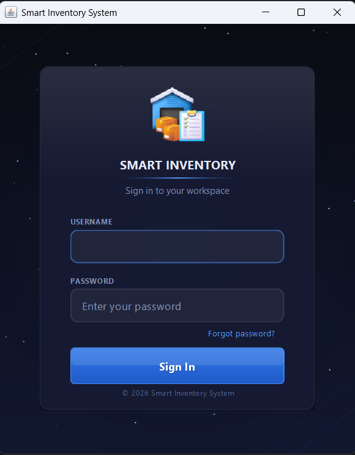
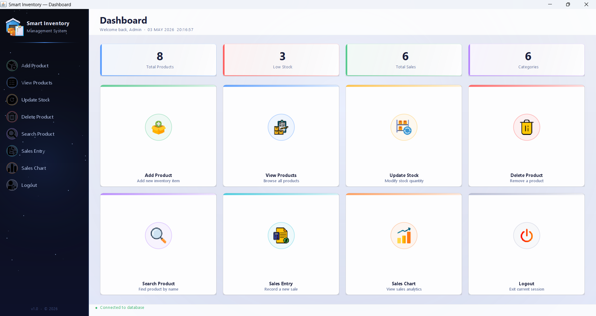
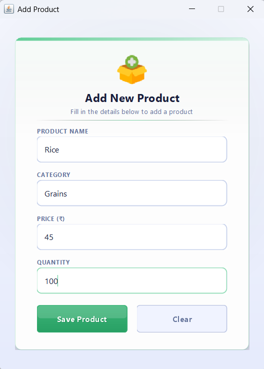
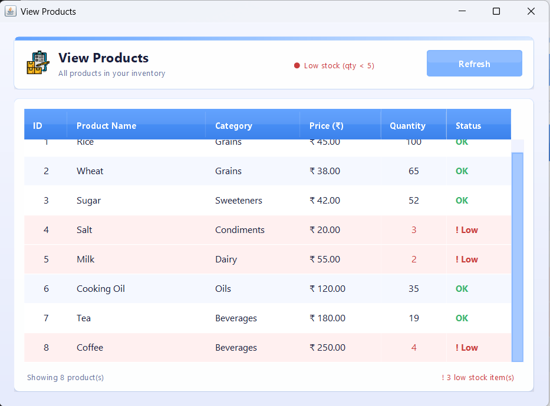
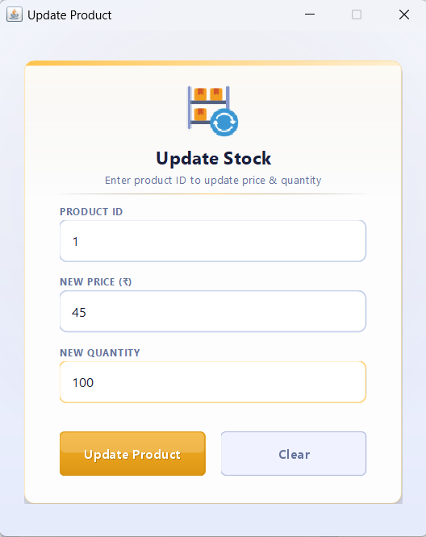
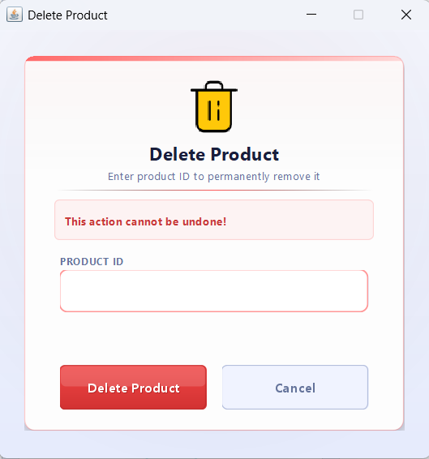
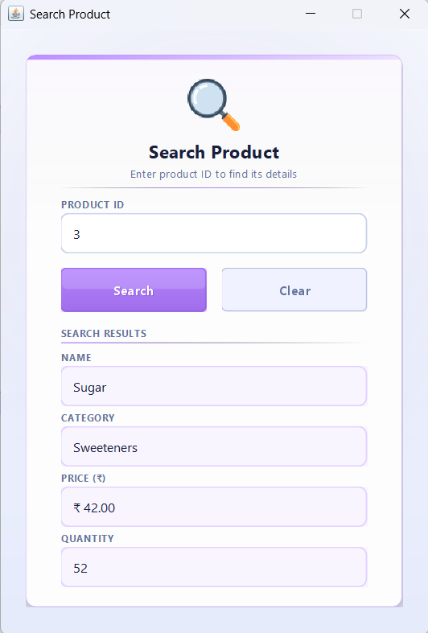
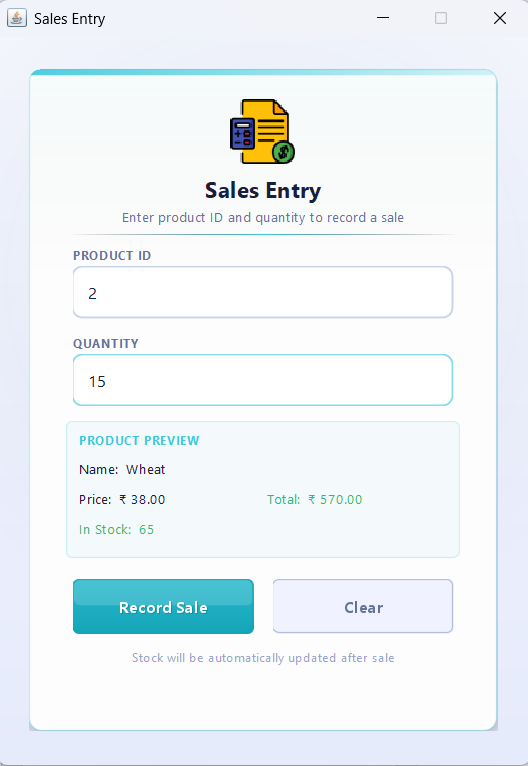
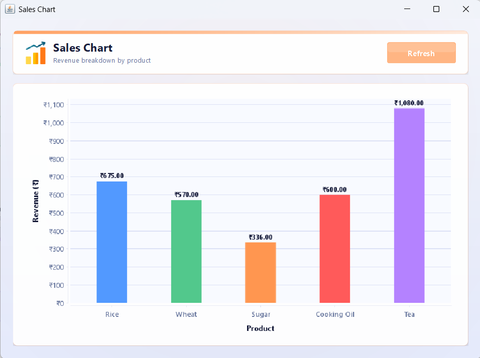

# 📦 Smart Inventory Management System

A desktop-based inventory management system built using **Java Swing** and **MySQL**, designed for small businesses and academic learning.

This application helps manage products, track stock levels, record sales, and visualize revenue insights through an intuitive graphical interface.

---

## 🎯 Project Objective

The goal of this project is to develop a complete inventory solution that demonstrates:
- Real-world CRUD operations
- Database integration using JDBC
- GUI-based desktop application development
- Data visualization techniques
  
---

## 🖥️ Screenshots

### Login Page


### Dashboard


### Add Product


### View Products


### Update Stock


### Delete Product


### Search Product


### Sales Entry


### Sales Chart


---

## ✨ Features

- 🔐 **Secure Login** — Username and password authentication
- 📊 **Live Dashboard** — Real-time stats showing total products, low stock alerts, total sales and categories
- ➕ **Add Product** — Add new products with validation and duplicate check
- 📋 **View Products** — View all products with automatic low stock row highlighting
- 🔄 **Update Stock** — Update product price and quantity by product ID
- 🗑️ **Delete Product** — Delete product with confirmation dialog
- 🔍 **Search Product** — Search and view complete product details by ID
- 💰 **Sales Entry** — Record sales with live product preview and auto total calculation
- 📈 **Sales Chart** — Visual bar chart showing revenue breakdown by product
- ⚠️ **Low Stock Alerts** — Automatic popup alerts when stock falls below 5 units
- 🎨 **Premium UI** — Custom painted components, animations, and consistent theme

---

## 🚀 Learning Outcomes

Through this project, I gained hands-on experience in:

- Java Swing GUI development
- JDBC integration with MySQL
- SQL CRUD operations
- Desktop application architecture
- Data visualization using JFreeChart
- Exception handling and validation

---

## 🛠️ Tech Stack

| Technology | Usage |
|---|---|
| Java Swing | UI / Frontend |
| MySQL 8.0 | Database |
| JDBC | Database connectivity |
| JFreeChart | Sales bar chart |
| IntelliJ IDEA | IDE |

---

## 📁 Project Structure

```
Smart-Inventory-System/
├── src/
│   ├── Login.java
│   ├── Dashboard.java
│   ├── DBConnection.java
│   ├── AddProduct.java
│   ├── ViewProducts.java
│   ├── UpdateProduct.java
│   ├── DeleteProduct.java
│   ├── SearchProduct.java
│   ├── SalesEntry.java
│   ├── SalesChart.java
│   └── FancyDialog.java
├── images/
├── screenshots/
└── README.md
```

---

## 🗄️ Database Setup

**Step 1** — Open MySQL Workbench and run:

```sql
CREATE DATABASE inventory_db;
USE inventory_db;
```

**Step 2** — Create tables:

```sql
CREATE TABLE users (
    id INT AUTO_INCREMENT PRIMARY KEY,
    username VARCHAR(50) NOT NULL,
    password VARCHAR(50) NOT NULL
);

CREATE TABLE products (
    id INT AUTO_INCREMENT PRIMARY KEY,
    name VARCHAR(100) NOT NULL,
    category VARCHAR(50),
    price DOUBLE,
    quantity INT
);

CREATE TABLE sales (
    id INT AUTO_INCREMENT PRIMARY KEY,
    product_name VARCHAR(100),
    qty INT,
    total DOUBLE
);
```

**Step 3** — Add default admin user:

```sql
INSERT INTO users(username, password) 
VALUES('admin', 'admin123');
```

---

## ⚙️ How to Run

**Step 1** — Clone the repository:
```bash
git clone https://github.com/HiteshKumar360/Smart-Inventory-System.git
```

**Step 2** — Open in **IntelliJ IDEA**

**Step 3** — Add JAR dependencies:
- `mysql-connector-j-9.x.jar`
- `jfreechart-1.x.jar`
- `jcommon-1.x.jar`

**Step 4** — Update `DBConnection.java`:
```java
String url  = "jdbc:mysql://localhost:3306/inventory_db";
String user = "root";
String pass = "yourpassword";
```

**Step 5** — Run `Login.java`

---

## 🔑 Default Login Credentials

| Username | Password |
|---|---|
| admin | admin123 |

---

## 📌 System Requirements

| Requirement | Version |
|---|---|
| Java JDK | 17 or higher |
| MySQL | 8.0 or higher |
| IntelliJ IDEA | Any recent version |
| OS | Windows 10/11 |

---

## 🎨 UI Highlights

- **Dark navy sidebar** with twinkling star animation
- **White main content** area with soft gradient
- **Custom FancyDialog** replacing all plain system dialogs
- **Hover animations** on all cards and buttons
- **Color coded** status — green OK, red Low Stock
- **Live stats bar** with real time database counts
- **Consistent accent colors** per screen

---

## 🔮 Future Enhancements

- 📄 **Export Reports** — Generate and download reports in PDF and Excel formats
- 👥 **Role-Based Access Control** — Implement Admin and Staff level permissions
- 📦 **Barcode Integration** — Add barcode scanner support for faster product management
- 🖼️ **Product Image Support** — Upload and display product images
- ☁️ **Cloud Deployment** — Host database and application on cloud platforms (AWS / Firebase)
- 🔔 **Email Notifications** — Send alerts for low stock and sales updates
- 📱 **Mobile App Integration** — Develop a companion mobile application
- 📊 **Advanced Analytics Dashboard** — Add predictive insights and trend analysis
- 🔐 **Enhanced Security** — Implement password hashing and secure authentication
- 🌐 **Web-Based Version** — Convert the application into a full-stack web app

---

## 👨‍💻 Developer

**Hitesh Kumar**

- GitHub: [@HiteshKumar360](https://github.com/HiteshKumar360)

---

## 📄 License

This project is developed for educational purposes.
